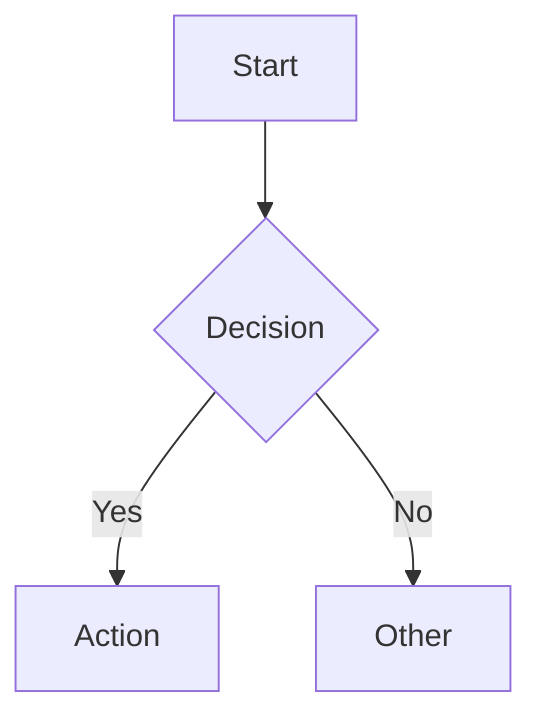

# Obsidian-Specific Markdown: Complete Reference for Claude

## Research Question
What Obsidian-specific markdown syntax, features, and conventions must Claude understand to correctly read and write vault files programmatically?

## Summary
Obsidian extends CommonMark + GitHub Flavored Markdown with proprietary extensions for knowledge management. Claude must understand wikilinks, embeds, callouts, block references, comments, highlight syntax, YAML properties (with strict rules around plural forms, flat structures, and quoted wikilinks), and community plugin syntax (Dataview inline fields, Tasks emoji markers, Templater commands). The official kepano/obsidian-skills repo (9.7k stars, by Obsidian CEO) provides the authoritative skill definitions. This document serves as a comprehensive reference for all Obsidian-specific syntax that differs from standard markdown.

## Detailed Findings

### 1. Obsidian Flavored Markdown (OFM) - Foundation

Obsidian combines three standards plus proprietary extensions:
- **CommonMark** (base markdown)
- **GitHub Flavored Markdown** (tables, task lists, strikethrough, autolinks)
- **Obsidian extensions** (wikilinks, embeds, callouts, block refs, comments, highlights)

**Not supported in Obsidian:**
- Heading IDs (`{#custom-id}` CommonMark extension)
- Definition lists
- Emoji shortcodes (`:smile:` — must paste actual Unicode emoji)

**Sources:** [Obsidian Flavored Markdown - Obsidian Help](https://help.obsidian.md/obsidian-flavored-markdown), [Basic formatting syntax - Obsidian Help](https://help.obsidian.md/Editing+and+formatting/Basic+formatting+syntax)

### 2. Wikilinks (Internal Links)

Wikilinks create bidirectional connections between notes automatically.

**Syntax variants:**
```markdown
[[Note Name]]                     # Basic link
[[Note Name|Custom Display]]      # Display text alias
[[Note Name#Heading]]             # Link to heading
[[#Heading]]                      # Link to heading in current note
[[Note Name#^block-id]]           # Link to specific block
[[Note Name#^block-id|Display]]   # Block link with alias
[[##heading text]]                # Search link by heading
[[^^block text]]                  # Search link by block content
```

**Key rules:**
- Spaces in filenames need NO encoding in wikilinks (unlike markdown links which need `%20`)
- Case-sensitive file matching
- Obsidian auto-resolves shortest unique path — full paths not required unless ambiguous
- Creating a wikilink to a non-existent note shows it in a different color; clicking creates the note

**Standard markdown links (alternative):**
```markdown
[Display Text](Note%20Name.md)           # Internal (spaces = %20)
[Display Text](https://example.com)      # External URL
[Note](obsidian://open?vault=Name&file=Note.md)  # Obsidian URI
```

**When to use which:** Wikilinks for internal vault connections (supports backlinks). Standard markdown links for external URLs.

**Sources:** [Internal links - Obsidian Help](https://help.obsidian.md/links), [GitHub - kepano/obsidian-skills](https://github.com/kepano/obsidian-skills)

### 3. Block References

Block IDs enable granular linking to specific paragraphs, list items, or any content block.

**Creating a block ID (manual):**
```markdown
This is a paragraph with a block ID. ^my-block-id

- List item with ID ^list-item-id
```

**Automatic generation:** When typing `[[Note#^` and selecting a block, Obsidian auto-generates random IDs like `^dcf64c`.

**Block ID rules:**
- Can only contain: Latin letters, numbers, hyphens
- Must be unique within the note
- Placed at the END of the block, after a space and `^`
- Cannot contain spaces or special characters

**Linking to blocks:**
```markdown
[[Note#^block-id]]          # Link to block
[[Note#^block-id|Display]]  # Block link with alias
![[Note#^block-id]]         # Embed the block
```

**Sources:** [Link to blocks - Obsidian Help](https://help.obsidian.md/How+to/Link+to+blocks), [Block Reference ID Generation - Obsidian Forum](https://forum.obsidian.md/t/block-reference-id-generation-question/7669)

### 4. Embeds (Transclusions)

Embeds render content from other files inline. Prefix any wikilink with `!` to embed.

```markdown
![[Note Name]]                    # Embed entire note
![[Note Name#Heading]]            # Embed specific heading section
![[Note Name#^block-id]]          # Embed specific block
![[image.png]]                    # Embed image (native size)
![[image.png|640]]                # Width only (maintains aspect ratio)
![[image.png|640x480]]            # Width x Height
![[audio.mp3]]                    # Embed audio player
![[video.mp4]]                    # Embed video player
![[document.pdf]]                 # Embed PDF
![[document.pdf#page=3]]          # Embed PDF at specific page
```

**Supported audio formats:** .flac, .m4a, .mp3, .ogg, .wav, .webm, .3gp
**Supported video formats:** .mkv, .mov, .mp4, .ogv, .webm

**Sources:** [Embed files - Obsidian Help](https://help.obsidian.md/How+to/Embed+files), [Embedding files - Obsidian Help](https://help.obsidian.md/Linking+notes+and+files/Embedding+files)

### 5. Callouts

Callouts combine visual styling with semantic meaning. Built on blockquote syntax.

**Basic syntax:**
```markdown
> [!note]
> Content here

> [!tip] Custom Title
> Content with a custom title

> [!warning]+ Expanded by Default
> This callout starts open (foldable)

> [!danger]- Collapsed by Default
> This callout starts closed (foldable)
```

**All built-in callout types (with aliases):**

| Type | Aliases | Color |
|------|---------|-------|
| `note` | — | Blue |
| `abstract` | `summary`, `tldr` | Teal |
| `info` | — | Blue |
| `todo` | — | Blue |
| `tip` | `hint`, `important` | Cyan |
| `success` | `check`, `done` | Green |
| `question` | `help`, `faq` | Yellow |
| `warning` | `caution`, `attention` | Orange |
| `failure` | `fail`, `missing` | Red |
| `danger` | `error` | Red |
| `bug` | — | Red |
| `example` | — | Purple |
| `quote` | `cite` | Gray |

**Nested callouts:**
```markdown
> [!question] Parent
> Content
>
> > [!note] Nested
> > Nested content
```

**Sources:** [Callouts - Obsidian Help](https://help.obsidian.md/callouts), [Using Callouts in Obsidian - Obsidian Rocks](https://obsidian.rocks/using-callouts-in-obsidian/)

### 6. Comments

Hidden in Reading/Preview mode, visible in Edit/Source mode.

```markdown
%%This entire line is hidden%%

Visible text %%inline hidden comment%% more visible text

%%
Multi-line comments
spanning several lines
are also supported
%%
```

**Sources:** [Obsidian Forum: What is %% used for?](https://forum.obsidian.md/t/what-is-used-for/16508)

### 7. Highlight Syntax

Obsidian-specific extension not in CommonMark or GFM:

```markdown
==highlighted text==
```

Renders with a yellow/highlight background in Reading mode.

**Sources:** [Basic formatting syntax - Obsidian Help](https://help.obsidian.md/Editing+and+formatting/Basic+formatting+syntax)

### 8. Tags

**Inline tags:**
```markdown
#tag
#nested/child-tag
#project/website/frontend
```

**YAML frontmatter tags:**
```yaml
---
tags:
  - tag1
  - parent/child
---
```

**Tag rules:**
- Must contain at least one non-numerical character (`#2023` alone is invalid)
- Valid characters: letters, numbers, underscore (`_`), hyphen (`-`)
- Forward slash (`/`) creates nested hierarchy
- Cannot contain spaces
- Case-sensitive
- `#` prefix required for inline; no prefix in YAML

**Sources:** [Tags - Obsidian Help](https://help.obsidian.md/tags)

### 9. Math (MathJax/LaTeX)

**Inline math:**
```markdown
The formula $E = mc^2$ is inline.
```

**Block math:**
```markdown
$$
\sum_{i=1}^{n} i = \frac{n(n+1)}{2}
$$
```

**Sources:** [How to Write Mathematical Notations in Obsidian - MakeUseOf](https://www.makeuseof.com/write-mathematical-notation-obsidian/)

### 10. Mermaid Diagrams

Native support via fenced code blocks:

````markdown

````

**Supported diagram types:** flowcharts, sequence diagrams, class diagrams, Gantt charts, pie charts, git graphs, ER diagrams, state diagrams.

**Direction keywords:** `TD` (top-down), `LR` (left-right), `BT` (bottom-top), `RL` (right-left)

**Sources:** [Mermaid Diagrams for Obsidian - Level Up Coding](https://levelup.gitconnected.com/mermaid-diagrams-for-obsidian-note-taking-b022b570e01c)

### 11. Footnotes

```markdown
Text with footnote.[^1]
Named footnote.[^my-note]
Inline footnote^[Content right here].

[^1]: Standard footnote definition.
[^my-note]: Named footnote definition.
```

**Sources:** [Quick Tip: Footnotes in Obsidian - Obsidian Rocks](https://obsidian.rocks/footnotes-in-obsidian/)

### 12. YAML Properties (Frontmatter) — Critical Rules

**Basic structure (must be first thing in file):**
```yaml
---
tags:
  - tag1
  - tag2
aliases:
  - alternate-name
cssclasses:
  - custom-class
date: 2026-02-12
type: note
status: active
---
```

**CRITICAL RULES FOR CLAUDE:**

1. **Always use PLURAL forms:** `tags` (not `tag`), `aliases` (not `alias`), `cssclasses` (not `cssclass`). Singular forms were **dropped in Obsidian 1.9** and no longer display.

2. **Format reserved properties as LISTS:** Use hyphen-style arrays, not comma-separated strings.
   ```yaml
   # CORRECT
   tags:
     - tag1
     - tag2

   # ALSO CORRECT
   tags: [tag1, tag2]

   # WRONG (broken since 1.9)
   tags: tag1, tag2
   ```

3. **Quote wikilinks in properties:** Internal links MUST be surrounded with quotes.
   ```yaml
   # CORRECT
   related: "[[Other Note]]"
   links:
     - "[[Note A]]"
     - "[[Note B]]"

   # WRONG
   related: [[Other Note]]
   ```

4. **NO nested YAML:** Obsidian Properties panel does NOT support nested objects. They won't display in the UI. Use flat, descriptive field names instead.
   ```yaml
   # WRONG
   author:
     name: John
     email: john@example.com

   # CORRECT
   author-name: John
   author-email: john@example.com
   ```

5. **Escape colons in values:** Values containing `: ` (colon followed by space) must be quoted.
   ```yaml
   title: "Note: An Important Topic"
   ```

6. **Property types are VAULT-WIDE:** Once a property name is given a type (text, number, date, list, checkbox, datetime), ALL files using that property name must conform to that type.

7. **Date format:** Use ISO 8601: `YYYY-MM-DD` for dates, `YYYY-MM-DDTHH:MM:SS` for datetimes. Not all ISO 8601 variants are accepted.

8. **Checkbox has 3 states:** `true` (checked), `false` (unchecked), or empty/omitted (neither). This is NOT a simple boolean.

9. **Empty values display as `[null]`:** Properties with only a dash or no value show as `[null]` in the UI and return null in Dataview queries.

10. **Avoid YAML multiline operators:** `|` (literal block) and `>` (folded block) may be marked as "Invalid YAML" in some Obsidian contexts. Use lists instead.

**Property types:**
- **Text** — any string value
- **List** — multiple text entries (hyphen or bracket notation)
- **Number** — integers and decimals only (no expressions)
- **Checkbox** — true/false/empty (3 states)
- **Date** — `YYYY-MM-DD`
- **Date & Time** — `YYYY-MM-DDTHH:MM:SS`

**Community standard properties (not official but widely used):**
- `type` — note type classification (daily, person, project, moc, resource)
- `status` — workflow state (draft, in-progress, done)
- `created` — creation timestamp
- `modified` — last modification timestamp
- `author` — author name

**Obsidian Publish properties:**
- `publish` — true/false to include/exclude from published site
- `permalink` — custom URL slug
- `description` — meta description for SEO
- `cover` or `image` — social media preview image

**Sources:** [Properties - Obsidian Help](https://help.obsidian.md/properties), [Fixing YAML Metadata in Obsidian 1.9](https://practicalpkm.com/fixing-yaml-metadata-in-obsidian-1-9/), [Obsidian 1.9.10 Changelog](https://obsidian.md/changelog/2025-08-18-desktop-v1.9.10/)

### 13. Dataview Plugin Syntax (Community — Very Common)

Dataview is the most popular query plugin. Claude will encounter its syntax frequently.

**DQL Query Types:**
```
LIST                           # Bullet list of pages
TABLE field1, field2           # Table with columns
TASK                           # Interactive task list
CALENDAR date-field            # Calendar dot view
```

**Data Commands:**
```
FROM #tag                      # Filter by tag (includes subtags)
FROM "folder"                  # Filter by folder (includes subfolders)
FROM [[note]]                  # Pages linking TO this note
FROM outgoing([[note]])        # Pages this note links TO
FROM #tag AND "folder"         # Combine with AND/OR
FROM -#tag                     # Negation
WHERE field > value            # Filter by field value
SORT field ASC/DESC            # Order results
GROUP BY field                 # Group results
FLATTEN array-field            # Split arrays into rows
LIMIT 10                       # Cap results
```

**Inline fields (double colon):**
```markdown
Basic Field:: Some random Value
I rate this [rating:: 9] out of 10.
- [ ] Task [due:: 2026-04-05]
Hidden key: (longKey:: value)
```

**IMPORTANT:** Inline fields use DOUBLE colon `::` (not single `:` like YAML frontmatter).

**Inline queries:**
```markdown
`= this.field`                 # Inline DQL
`= date(today)`               # Inline function
`$= dv.current().file.mtime`  # Inline DataviewJS
```

**DataviewJS code blocks:**
````markdown
```dataviewjs
let pages = dv.pages("#books")
  .where(b => b.rating >= 7);
dv.table(["Name", "Rating"],
  pages.map(b => [b.file.link, b.rating]));
```
````

**File metadata fields:** `file.name`, `file.path`, `file.folder`, `file.tags`, `file.ctime`, `file.mtime`, `file.size`, `file.inlinks`, `file.outlinks`, `file.aliases`, `file.day` (if filename contains date), `file.tasks`, `file.lists`, `file.frontmatter`

**Sources:** [Dataview Documentation](https://blacksmithgu.github.io/obsidian-dataview/), [Adding Metadata - Dataview](https://blacksmithgu.github.io/obsidian-dataview/annotation/add-metadata/)

### 14. Tasks Plugin Syntax (Community — Common)

Extended task format with emoji markers:

```markdown
- [ ] Task text 📅 2026-01-15 ⏫ ⏳ 2026-01-10 🛫 2026-01-08 🔁 every week
```

**Date emoji markers:**
- 📅 Due date
- ⏳ Scheduled date
- 🛫 Start date
- ✅ Done/completion date
- ➕ Created date

**Priority emoji markers:**
- ⏫ Highest priority
- 🔼 High priority
- 🔽 Low priority
- ⏬ Lowest priority

**Other markers:**
- 🔁 Recurrence rule
- ❌ Cancelled
- 🆔 Task ID

**Task query blocks:**
````markdown
```tasks
not done
due before tomorrow
sort by priority
```
````

**Sources:** [Tasks User Guide](https://publish.obsidian.md/tasks/), [Tasks Emoji Format](https://publish.obsidian.md/tasks/Reference/Task+Formats/Tasks+Emoji+Format)

### 15. Templater Plugin Syntax (Community — Common)

Templater commands appear in template files before execution:

```markdown
<% tp.date.now() %>                    # Current date (YYYY-MM-DD)
<% tp.date.now("Do MMMM YYYY") %>     # Formatted date
<% tp.date.now("YYYY-MM-DD", 7) %>    # Date + 7 days offset
<% tp.file.title %>                    # Current file title
<% tp.file.folder() %>                # Current folder name
<% tp.file.cursor() %>                # Set cursor position after template
<% tp.frontmatter.field_name %>       # Access frontmatter value
<% tp.system.clipboard() %>           # Clipboard contents
<% tp.system.prompt("Question?") %>   # User input modal
<%* code %>                            # Execute JS (no output)
```

**Key modules:** `tp.date`, `tp.file`, `tp.frontmatter`, `tp.system`, `tp.web`, `tp.config`, `tp.obsidian`, `tp.app`, `tp.hooks`

**Claude should NOT execute Templater commands** — recognize them as template syntax and preserve them as-is when editing template files.

**Sources:** [Templater Documentation](https://silentvoid13.github.io/Templater/)

### 16. Kanban Plugin Markdown Format

Kanban boards are stored as markdown files:

```markdown
---
kanban-plugin: basic
---

## Column Name 1
- [ ] Card item 1
- [ ] Card item 2

## Column Name 2
- [ ] Another card
```

**Structure:** `kanban-plugin: basic` frontmatter + H2 headers as columns + checkbox items as cards.

**Sources:** [GitHub - mgmeyers/obsidian-kanban](https://github.com/mgmeyers/obsidian-kanban)

### 17. JSON Canvas (.canvas files)

Open file format for infinite canvas. NOT markdown — it's JSON.

```json
{
  "nodes": [
    {"id": "a1b2c3d4e5f6g7h8", "type": "text", "x": 0, "y": 0, "width": 400, "height": 200, "text": "# Heading\nContent"},
    {"id": "i9j0k1l2m3n4o5p6", "type": "file", "x": 500, "y": 0, "width": 400, "height": 200, "file": "path/to/note.md"}
  ],
  "edges": [
    {"id": "q7r8s9t0u1v2w3x4", "fromNode": "a1b2c3d4e5f6g7h8", "toNode": "i9j0k1l2m3n4o5p6"}
  ]
}
```

**Node types:** text, file, link, group
**IDs:** 16-character lowercase hexadecimal, 64-bit random values
**Coordinates can be negative** (infinite canvas)

**IMPORTANT:** Do not use literal `\n` in .canvas files — Obsidian renders it as the characters `\` and `n` instead of a line break.

**Sources:** [JSON Canvas Spec](https://jsoncanvas.org/), [GitHub - kepano/obsidian-skills](https://github.com/kepano/obsidian-skills)

### 18. Obsidian Bases (.base files)

Native database feature (beta). YAML files, not markdown.

**File extension:** `.base`
**Components:** sources/data definitions, property configs, filters, views (table/card), formulas
**Reads from:** note YAML frontmatter properties

**Sources:** [Introduction to Bases - Obsidian Help](https://help.obsidian.md/bases), [Bases syntax - Obsidian Help](https://help.obsidian.md/bases/syntax)

### 19. kepano/obsidian-skills — Authoritative Reference

The official skills repo by Obsidian CEO Steph Ango (9.7k stars, MIT license):

**5 skills:**
1. **obsidian-markdown** — OFM syntax reference + creation/editing
2. **obsidian-bases** — .base file creation and editing
3. **json-canvas** — .canvas file creation and editing
4. **obsidian-cli** — vault CLI interface, plugin/theme dev
5. **defuddle** — clean markdown extraction from web pages

**Install:** `/plugin marketplace add kepano/obsidian-skills` then `/plugin install obsidian@obsidian-skills`

**Sources:** [GitHub - kepano/obsidian-skills](https://github.com/kepano/obsidian-skills)

## Source Conflicts

**Wikilinks in YAML:** Some community guides show unquoted wikilinks in frontmatter, but Obsidian 1.4+ requires quotes around `[[wikilinks]]` in property values. Always quote them.

**Tag format:** Older guides show `tags: tag1, tag2` (comma-separated string). This is broken since Obsidian 1.9. Always use list format.

**Callout type count:** Some sources list 13 types, others list more due to counting aliases separately. The 13 base types have aliases (e.g., `tip`/`hint`/`important` are the same callout).

**Multiline YAML:** YAML spec supports `|` and `>` operators, but Obsidian may flag them as invalid. Safer to use list syntax.

## Currency Assessment
- Most recent sources: February 2026 (Obsidian 1.9.x, kepano/obsidian-skills)
- Topic velocity: Medium — core syntax is stable, properties system still evolving
- Confidence in currency: High for OFM syntax, high for properties (1.9+ changes documented), medium for plugin syntax (Dataview stable, Tasks actively updated)

## Open Questions
- What is the exact maximum length for block IDs?
- How does Obsidian resolve duplicate headings in wikilinks? (e.g., two `## Summary` in same file)
- What is the recursion limit for embedded notes that embed each other?
- How does Obsidian handle nested callout depth limits?
- Will Bases eventually supersede Dataview for common query patterns?
- What is the complete .base file YAML schema?
