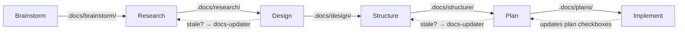

# BRDSPI Artifact Pipeline

Each domain plugin (code, vault, services) follows the same six-phase pipeline: Brainstorm, Research, Design, Structure, Plan, Implement. Skills chain through `.docs/` artifacts — each phase reads its upstream output and writes its own via the docs-writer agent (haiku model, fast formatting).

## How artifacts flow

Each edge label shows the `.docs/` subdirectory where that phase's output lands. The next phase reads it as input. All artifacts get standardized frontmatter (date, status, topic, tags, git_commit) from docs-writer.

The dashed backward arrows show **staleness detection** — currently active in the code domain. When a skill reads an upstream artifact whose `git_commit:` is more than 3 commits behind HEAD, it spawns docs-updater (opus model) to decide between refreshing the content or archiving it.

## Agent roles

| Agent | Model | Job |
|-------|-------|-----|
| docs-writer | haiku | Creates `.docs/` files with standardized frontmatter. Spawned by all 23 domain skills. |
| docs-updater | opus | Decides whether to update or archive stale docs. Spawned by 6 skills across 4 plugins. |

docs-writer uses haiku because it's a formatting task — speed matters more than reasoning. docs-updater uses opus because it makes critical archive-vs-update decisions that affect downstream skills.

## Three parallel chains

The three domain plugins run this same pattern with domain-specific skill names. See the individual workflow pages for details:

- [Code Workflow](code-workflow.md) — software projects (8 skills, 3 agents, staleness detection)
- [Vault Workflow](vault-workflow.md) — Obsidian vault management (8 skills, 2 extra utility skills)
- [Services Workflow](services-workflow.md) — homelab Docker infrastructure (6 skills, straight BRDSPI)
