# Code Workflow

commandbase-code provides the BRDSPI chain for software projects — 8 skills and 3 research agents. It depends on commandbase-core for documentation agents and cross-references `/committing-changes` from git-workflow.

## Skill chain

```mermaid
flowchart LR
    bc["/brainstorming-code"] -->|".docs/brainstorm/"| rc["/researching-code"]
    rc -->|".docs/research/"| dc["/designing-code"]
    dc -->|".docs/design/"| sc["/structuring-code"]
    sc -->|".docs/structure/"| pc["/planning-code"]
    pc -->|".docs/plans/"| ip["/implementing-plans"]
    ip -.->|"updates plan checkboxes"| pc

    dc -.->|"stale? → docs-updater"| rc
    pc -.->|"stale? → docs-updater"| sc
```

## Skills

| Skill | Phase | What it does |
|-------|-------|-------------|
| /brainstorming-code | Brainstorm | Explore direction and preferences before research — layout vs API vs CLI, high-level architecture choices |
| /researching-code | Research | Investigate the codebase to understand how it works — trace data flows, map components, document implementations |
| /designing-code | Design | Make architectural decisions — API shapes, patterns, trade-offs, component boundaries, error handling |
| /structuring-code | Structure | Map file placement, module organization, dependency structure, test layout |
| /planning-code | Plan | Create phased implementation plans with success criteria, spawns research agents first |
| /implementing-plans | Implement | Execute plans from `.docs/plans/` with automated verification, updates checkboxes as phases complete |
| /debugging-code | — | Systematic debugging with hypothesis tracking — not part of the BRDSPI chain |
| /starting-refactors | — | Initialize brownfield refactors — snapshot baseline state, audit the target area, set scope |

## Agents

Three research agents help skills explore the codebase:

| Agent | Model | What it does | Spawned by |
|-------|-------|-------------|-----------|
| code-analyzer | sonnet | Analyzes implementation details for specific components | /researching-code, /planning-code |
| code-librarian | sonnet | Finds similar implementations, usage examples, existing patterns | /researching-code, /structuring-code |
| code-locator | sonnet | Locates files, directories, and components by topic | /researching-code, /planning-code, /starting-refactors |

Skills that need codebase context decompose their research into 2-4 angles and spawn these agents in parallel, then synthesize the results.

## Staleness detection

This is the only domain plugin with automatic staleness detection. Two skills check upstream artifacts before reading them:

- **/designing-code** checks `.docs/research/` — if the research doc's `git_commit:` is >3 commits behind HEAD, it spawns docs-updater to refresh or archive
- **/planning-code** checks `.docs/structure/` — same staleness threshold and docs-updater delegation

docs-updater runs on the opus model because it makes the critical archive-vs-update decision.

## Checkpoint integration

- **/planning-code** suggests creating a `"plan-approved"` checkpoint via /bookmarking-code
- **/implementing-plans** creates `"phase-N-done"` checkpoints after each verified phase
- **/starting-refactors** creates `"pre-refactor-<area>"` before auditing the target code
