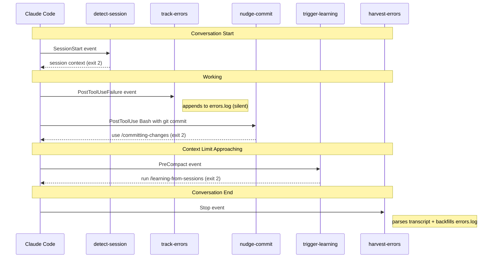

# Hook Execution Timeline

Five hooks fire at different conversation lifecycle points. They don't invoke skills directly — they prepare state files (errors.log, meta.json) and send feedback via stderr (exit code 2). Users or Claude decide when to act on the nudges.

## Hook reference

| Hook | Plugin | Event | Fires when |
|------|--------|-------|-----------|
| detect-session | session | SessionStart | Every conversation start |
| track-errors | session | PostToolUseFailure | Any tool call fails |
| nudge-commit | git-workflow | PostToolUse:Bash | Bash runs git commit or git push |
| trigger-learning | session | PreCompact | Context window is about to compact |
| harvest-errors | session | Stop | Every conversation end |

## Exit code semantics

| Code | Meaning | Example |
|:----:|---------|---------|
| 0 | Silent — no output to conversation | track-errors appends to errors.log without telling Claude |
| 1 | Error — hook failed | Script crash, missing dependency |
| 2 | Feedback — inject stderr into conversation | detect-session prints session context for Claude to read |

## Two-phase error tracking

Two hooks work together to catch errors:

- **track-errors** (real-time): Fires on every `PostToolUseFailure` event during the conversation. Appends structured JSONL entries to errors.log. Only catches subagent failures — main conversation errors aren't tool failures.
- **harvest-errors** (batch): Fires once at `Stop`. Parses the full conversation transcript, deduplicates against existing errors.log entries, and backfills anything the real-time hook missed.

This dual strategy means errors.log ends up with a complete picture regardless of how the errors surfaced.

## Three-layer commit enforcement

The nudge-commit hook is one layer of a three-part system:

1. **CLAUDE.md rule** — `~/.claude/CLAUDE.md` instructs Claude to always use /committing-changes
2. **PostToolUse hook** — nudge-commit-skill.py detects bare git commit/push, sends reminder (exit 2)
3. **Deny rules** — `~/.claude/settings.json` blocks `git add -A`, `git add .`, `git push --force`, `git reset --hard` at the tool level
