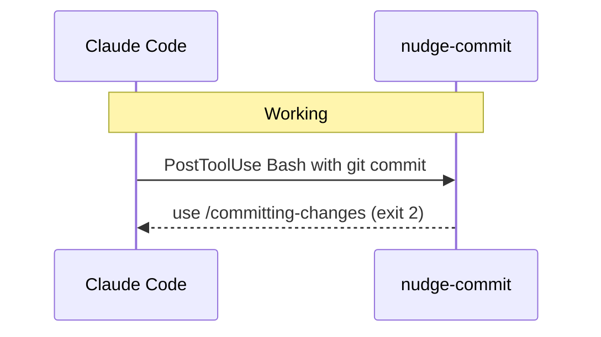

# Hook Execution Timeline

One hook fires during conversation lifecycle. It sends feedback via stderr (exit code 2) to nudge Claude toward the /committing-changes skill instead of bare git commands.

## Hook reference

| Hook | Plugin | Event | Fires when |
|------|--------|-------|-----------|
| nudge-commit | git-workflow | PostToolUse:Bash | Bash runs git commit or git push |

## Exit code semantics

| Code | Meaning | Example |
|:----:|---------|---------|
| 0 | Silent — no output to conversation | Hook completes without telling Claude |
| 1 | Error — hook failed | Script crash, missing dependency |
| 2 | Feedback — inject stderr into conversation | nudge-commit prints reminder for Claude to read |

## Three-layer commit enforcement

The nudge-commit hook is one layer of a three-part system:

1. **CLAUDE.md rule** — `~/.claude/CLAUDE.md` instructs Claude to always use /committing-changes
2. **PostToolUse hook** — nudge-commit-skill.py detects bare git commit/push, sends reminder (exit 2)
3. **Deny rules** — `~/.claude/settings.json` blocks `git add -A`, `git add .`, `git push --force`, `git reset --hard` at the tool level
