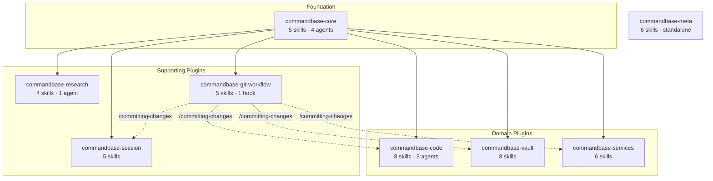

# Plugin Dependencies

commandbase-core is the foundation. It exports 4 documentation agents (docs-writer, docs-updater, docs-locator, docs-analyzer) that every other plugin relies on — except commandbase-meta, which stands alone as the skill/agent authoring toolkit.

The three domain plugins (code, vault, services) also cross-reference `/committing-changes` from git-workflow for their commit flows.

## What each plugin exports

| Plugin | Exports | Used by |
|--------|---------|---------|
| core | docs-writer, docs-updater, docs-locator, docs-analyzer, /bookmarking-code, /validating-code, /starting-projects | All except meta |
| git-workflow | /committing-changes, /reviewing-changes, /reviewing-security, /creating-prs, /auditing-docs | code, vault, services, session |
| code | code-analyzer, code-librarian, code-locator | Available to any conversation |
| research | web-researcher | Available to any conversation |
| meta | Standalone — no exports consumed by other plugins | — |

The most-referenced skill across the system is `/committing-changes` — it's invoked by /implementing-plans, /debugging-code, /ending-worktree, /validating-code, /starting-projects, and /reviewing-changes.
