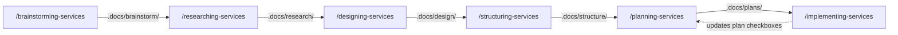

# Services Workflow

commandbase-services provides the BRDSPI chain for homelab Docker infrastructure — 6 skills, straight BRDSPI with no extras. It depends on commandbase-core for documentation agents and cross-references `/committing-changes` from git-workflow.

## Skill chain

## Skills

| Skill | Phase | What it does |
|-------|-------|-------------|
| /brainstorming-services | Brainstorm | Explore direction — reverse proxy choices, compose architecture, backup strategies, networking topology |
| /researching-services | Research | Map current infrastructure — running services, ports, volumes, networks, dependencies, backup coverage |
| /designing-services | Design | Make architecture decisions — stack topology, networking, auth approach, data management, monitoring |
| /structuring-services | Structure | Map compose file layout, .env templates, proxy routes, volume directories, backup config placement |
| /planning-services | Plan | Create phased deployment plans with success criteria, rollback steps, and verification checklists |
| /implementing-services | Implement | Execute plans — edit compose files, create configs, generate .env.example templates, update proxy routes |

## Straight BRDSPI

This is the simplest domain plugin — six skills matching the six BRDSPI phases with no extras. No additional agents, no staleness detection, no utility skills.

The implementation phase generates deployment commands for the user to execute rather than running infrastructure changes directly. This keeps destructive operations (container restarts, network changes) in the user's hands.

## No staleness detection

Like the vault domain, services skills don't auto-check upstream artifacts for staleness. Run `/auditing-docs` manually if you've made changes between phases.
