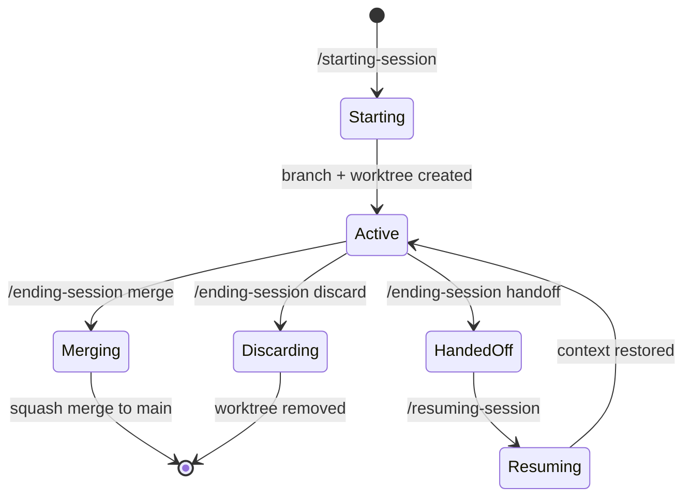

# Session Lifecycle

Sessions provide isolated workspaces via git branching and worktrees. `/starting-session` creates the branch and worktree, `/ending-session` offers three exit paths (merge, handoff, discard), and `/resuming-session` picks up where you left off.

## Auto-detection

When you restart Claude Code in an existing session worktree, the SessionStart hook auto-detects the active session and injects its context — you don't need to run `/resuming-session` for that case. The hook reads `session-map.json`, matches the current worktree to a session, and prints the session context via stderr (exit code 2).

## Resume modes

`/resuming-session` handles three situations:

| Mode | When | What happens |
|------|------|-------------|
| Worktree | Active session, same worktree | Read meta.json, errors.log, checkpoints, verify git state |
| Handoff | Handed-off session, new conversation | Read handoff doc with staleness check, absorb context |
| Picker | Multiple candidates | Unified picker showing all active and handed-off sessions |

## State files

Sessions track their state across these files:

| File | Location | Contents |
|------|----------|----------|
| session-map.json | Container root | Registry of all sessions (name, branch, worktree path, status) |
| meta.json | `{worktree}/.claude/sessions/{name}/` | Session metadata + Claude conversation UUIDs |
| errors.log | `{worktree}/.claude/sessions/{name}/` | JSONL error tracking from hooks |
| checkpoints.log | `{worktree}/.claude/sessions/{name}/` | Checkpoint history from /bookmarking-code |

## Ending modes

| Mode | What it does | Reversible? |
|------|-------------|-------------|
| Merge | Squash merge to main, remove worktree + branch, invoke /committing-changes | No |
| Handoff | Keep branch open, create `.docs/handoffs/` document, update status to "handed-off" | Yes — resume later |
| Discard | Force-remove worktree + branch after confirmation | No |
