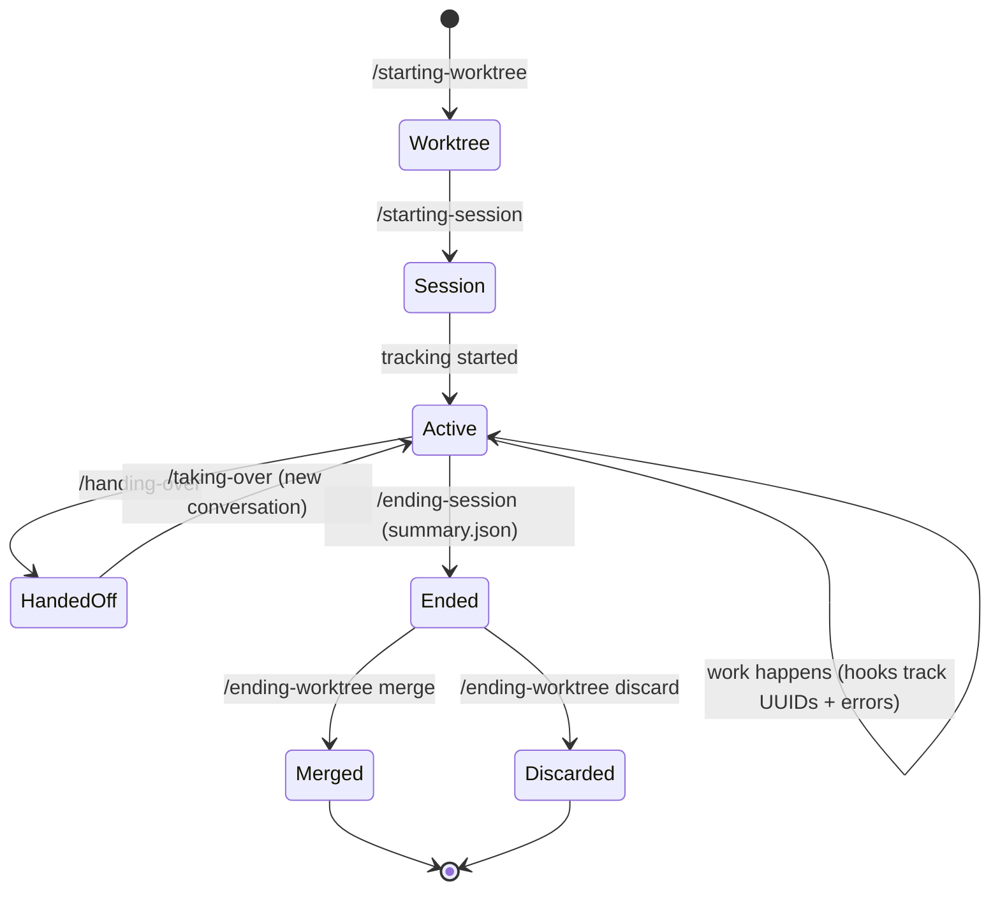

# Session Lifecycle

The session system uses three independent layers: worktree (git isolation), session (conversation tracking), and handoff (knowledge transfer).



## Three Layers

### Worktree Layer (git plumbing)

| Skill | What it does |
|-------|-------------|
| /starting-worktree | Creates branch + worktree, or migrates repo to bare-repo layout |
| /ending-worktree | Squash merges to main (Mode A) or force-discards (Mode B) |

Worktrees are independent of sessions. You can have a worktree without session tracking.

### Session Layer (tracking)

| Skill | What it does |
|-------|-------------|
| /starting-session | Discovery-driven setup -- asks purpose, writes meta.json, captures UUID |
| /ending-session | Closes tracking, produces .docs/sessions/{name}/summary.json |
| /resuming-session | Reads session state files, verifies git state, presents context |
| /learning-from-sessions | Extracts reusable knowledge from session errors |

One worktree can have multiple sessions (many-to-one). Only one active at a time.

### Handoff Layer (knowledge transfer)

| Skill | What it does |
|-------|-------------|
| /handing-over | Creates standalone handoff document with key learnings |
| /taking-over | Absorbs handoff document and restores context |

Handoffs are independent -- they work with or without active sessions.

## Auto-detection

When you restart Claude Code in a session worktree, the SessionStart hook auto-detects the active session and injects its context -- including session purpose. The hook reads `session-map.json`, matches the current worktree to an active session (filtering by `status: "active"`), and prints session context via stdout (exit 0).

## State files

| File | Location | Committed? | Purpose |
|------|----------|------------|---------|
| session-map.json | Container root | No | Session registry (many-to-one with worktrees) |
| meta.json | `.claude/sessions/{name}/` | No | Live session metadata + UUID list |
| errors.log | `.claude/sessions/{name}/` | No | Error tracking from hooks |
| checkpoints.log | `.claude/sessions/{name}/` | No | Checkpoint history |
| summary.json | `.docs/sessions/{name}/` | Yes | Permanent close-out summary |

## Typical workflow

```
/starting-worktree          # Create isolated branch + directory
cd {worktree}
/starting-session           # Discovery: what are you working on?
  [work happens]
/handing-over               # Optional: create handoff for another conversation
  [new conversation]
/taking-over handoff.md     # Optional: absorb the handoff
/ending-session             # Close tracking, produce summary.json
/ending-worktree            # Merge to main or discard (from main worktree)
```
